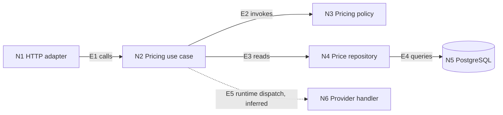
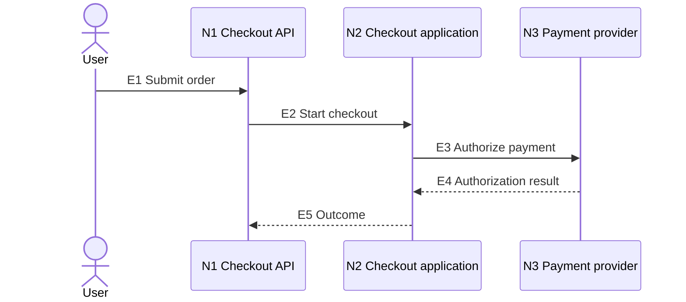
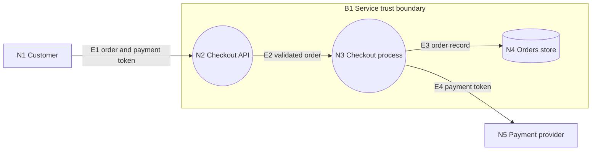
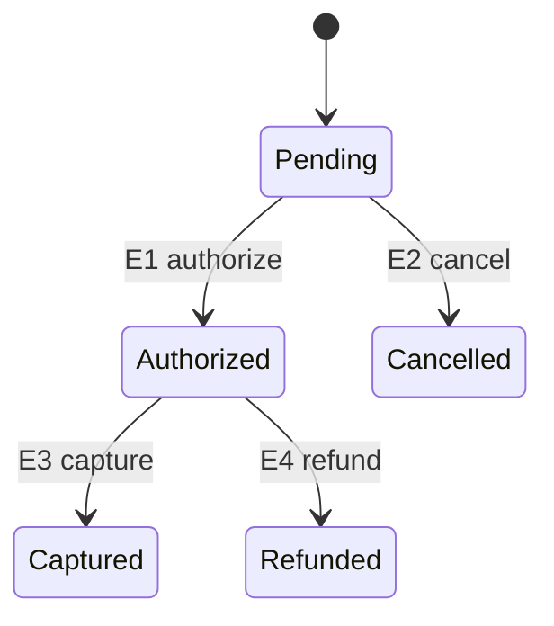

# Evidence-backed architecture views

Use this reference when relationships are materially easier to verify as a diagram than as prose. Build a view of the affected architecture, not an inventory of every file, class, or call.

## Contents

- [Decide whether to draw](#decide-whether-to-draw)
- [Set the question, scope, and zoom](#set-the-question-scope-and-zoom)
- [Collect and classify evidence](#collect-and-classify-evidence)
- [Aggregate code into architectural nodes](#aggregate-code-into-architectural-nodes)
- [Select one fitting view](#select-one-fitting-view)
- [Render a portable view](#render-a-portable-view)
- [Use view-specific rules](#use-view-specific-rules)
- [Report the view](#report-the-view)
- [Enforce diagram guardrails](#enforce-diagram-guardrails)

## Decide whether to draw

Draw a view when it clarifies a relationship needed for the decision:

- dependency direction, a cycle, or boundary leakage;
- an end-to-end request, event, retry, cancellation, or error path;
- data movement, storage, sensitive data, or a trust boundary;
- state ownership and legal transitions;
- deployment, process, or runtime separation;
- functional decomposition already expressed in IDEF0 terms.

Keep a compact text map when one caller, one operation, and one dependency explain the change. Do not create a system-wide diagram for a local helper. If the user requests a diagram but evidence is incomplete, render the verified slice and list unresolved edges instead of filling gaps.

## Set the question, scope, and zoom

State these fields before drawing:

- **Question:** the decision the view must support.
- **Snapshot:** branch, revision, or supplied artifact set.
- **Scope:** affected path and nearest relevant boundary.
- **Viewpoint:** runtime, module dependency, data, behavior, state, deployment, or function.
- **Status:** observed as-is or proposed to-be.

Use an abstraction ladder compatible with C4 vocabulary:

1. **Context:** people, the system under review, and external systems.
2. **Container:** separately running applications, services, jobs, data stores, and queues.
3. **Component:** cohesive modules behind a meaningful interface inside one container.
4. **Code evidence:** files, classes, functions, routes, registrations, and tests that prove higher-level nodes and edges.

Keep code evidence in the evidence index unless a symbol is itself the review subject. Do not call a directory a component or a process a container from naming alone. Use the repository's own architecture vocabulary when it conflicts with C4 terminology.

Prefer one primary view. Add a supporting view only when it answers a different question, such as a component graph for ownership plus a sequence diagram for one failure path.

For a cross-version view, resolve both snapshots, declare endpoint-to-endpoint or merge-base-to-target semantics, and apply the same scope, viewpoint, zoom, aggregation rule, and relation types. Preserve stable logical IDs across renamed or moved code. Read [architecture-comparison.md](architecture-comparison.md) before rendering a delta view.

Do not place removed and added files at architecture level until responsibility, contract, ownership, or runtime evidence establishes that their logical nodes changed.

## Collect and classify evidence

Read the repository before drawing. Inspect only sources relevant to the stated scope:

- workspace, package, module, and build manifests;
- deployment and infrastructure configuration;
- CODEOWNERS, package ownership metadata, and repository architecture records;
- entry points, routes, commands, jobs, and event handlers;
- imports, public contracts, calls across modules, and generated-code sources;
- database access, schemas, serializers, topics, queues, and external clients;
- dependency-injection registration, reflection metadata, plugin manifests, and feature flags;
- tests that exercise wiring, boundaries, or end-to-end behavior.

Prefer a repository-native dependency or architecture report when one is already configured. Do not add an analyzer merely to draw a routine view.

Classify every material relationship:

- **Observed:** a call, import, manifest, registration, configuration entry, schema, test, or runtime trace directly supports it.
- **Inferred:** static evidence suggests it, but runtime dispatch, reflection, configuration, or generated code prevents confirmation.
- **Proposed:** it belongs only to a candidate design.
- **Unknown:** available artifacts cannot establish the relationship.

Record evidence with stable IDs:

| ID | Element | Relationship | Evidence | Confidence |
|---|---|---|---|---|
| N1 | Checkout API | component | `src/http/checkout.ts` | high |
| E1 | API calls application service | calls | `checkout.ts:submit` | high |
| E2 | registry selects handler | dispatches | generated registry unavailable | low, inferred |

Do not promote an inferred or unknown edge to observed because it makes the diagram look complete.

## Aggregate code into architectural nodes

Create a node only when it has architectural meaning through at least one of these properties:

- responsibility or policy ownership;
- team or bounded-context ownership;
- process, runtime, or deployment boundary;
- persistent data ownership;
- external system or protocol boundary;
- trust or privilege boundary;
- public contract;
- demonstrated coupling, cycle, or decision hotspot.

Collapse helpers, data transfer objects, local controllers, and implementation classes into their owning node. Expand a node only when the review question depends on its internal structure. If the view becomes difficult to read, narrow the scenario or split it by zoom rather than shrinking labels or listing more code.

Treat a tree as a hierarchy view. Use it for ownership, containment, or function decomposition. Use a graph when calls, imports, data flows, or cycles cross branches. A source tree alone is not an architecture model.

## Select one fitting view

| Question | Primary view | Show | Avoid |
|---|---|---|---|
| What are the major parts and external dependencies? | Context, container, or component graph | responsibilities, boundaries, typed relationships | classes and files by default |
| Does dependency direction match repository rules? | Dependency graph | imports, calls, cycles, allowed direction | unlabeled generic arrows |
| How does one scenario execute? | Sequence diagram | ordered interactions, errors, retries, cancellation | every internal function call |
| Where does data cross or persist? | Data-flow diagram | external entities, processes, stores, named data, trust boundaries | substituting control flow for data flow |
| Which decisions form a business process? | Process flowchart | decisions, outcomes, failure exits, ownership lanes | using it as a call graph |
| Which transitions are legal? | State diagram | states, events, guards, effects, invalid transitions | treating ordinary branches as states |
| Where does software run and communicate? | Deployment view | nodes, processes, network paths, protocols, and trust zones | inferring production topology from local folders |
| Who owns or contains what? | Tree | containment, ownership, decomposition | hiding cross-branch dependencies |
| What transforms inputs under controls? | IDEF0 when required | input, control, output, mechanism and decomposition | calling a generic box-and-arrow chart IDEF0 |

Use IDEF0 only when the user, repository, or domain already requires functional ICOM decomposition. FIPS 183 is a withdrawn standard; treat it as a legacy notation reference, not a current compliance claim. If a strict IDEF0 renderer is unavailable, provide an ICOM table and label any Mermaid approximation as non-normative.

## Render a portable view

Use the repository's established diagram format first. Otherwise emit text-based Mermaid so the result remains reviewable as source. Prefer stable `flowchart`, `sequenceDiagram`, and `stateDiagram-v2` syntax. Confirm the repository's renderer version before using newer syntax. Mermaid's native C4 syntax is experimental; use it only when the repository pins and accepts that syntax.

Apply these conventions:

- include stable evidence IDs in node and edge labels;
- label edges with semantics such as `calls`, `imports`, `reads`, `writes`, `publishes`, `subscribes`, `generates`, or `configures`;
- draw observed edges as solid and inferred edges as dotted;
- place unknown relationships in a list rather than inventing an edge;
- use boundaries for architecture, deployment, ownership, or trust, not merely for folders;
- avoid color as the only status encoding;
- keep observed and proposed architecture in separate diagrams.

## Use view-specific rules

### Component or dependency graph

Use a flowchart with labeled boundaries and relationships:

Show a cycle only after confirming each participating edge. For dependency review, distinguish compile-time imports from runtime calls and data exchange.

### Sequence diagram

Select one named scenario. Keep participants at component or external-system level and attach evidence IDs to messages:

Include alternate, retry, timeout, cancellation, and compensation paths only when they affect the decision.

### Data-flow diagram

Model named data rather than generic arrows. Include external entities, processes, stores, and trust boundaries. A Mermaid flowchart can communicate these semantics but is not a dedicated DFD validator:

Identify sensitive data and the controls at each trust-boundary crossing in the accompanying evidence, not by an unlabeled boundary alone.

### Process flowchart

Show business decisions and outcomes. Label decisions with the policy source and keep implementation calls out unless they own a decision.

### State diagram

Use a state view only when state and legal transitions are the problem:

List guards, side effects, persistence, and invalid-transition handling in the evidence index.

### Ownership or decomposition tree

Label the rule that creates each parent-child relationship. Add a separate cross-link list when dependencies do not follow the tree. Do not duplicate a repository directory listing unless that listing represents verified ownership.

### IDEF0

For each function, produce the ICOM contract before rendering:

| Function | Inputs | Controls | Outputs | Mechanisms | Evidence |
|---|---|---|---|---|---|
| Authorize payment | payment request | risk policy, timeout | authorization result | payment adapter, key store | paths or symbols |

When an IDEF0 rendering is required, preserve the ICOM directions:

- inputs enter from the left;
- controls enter from the top;
- outputs leave on the right;
- mechanisms enter from the bottom.

Use verb phrases for functions and noun phrases for arrows. Preserve parent-child decomposition and boundary-arrow correspondence when strict IDEF0 is required. Do not claim IDEF0 conformance from this table or a generic Mermaid flowchart.

## Report the view

Return the smallest decision-ready package:

1. question, snapshot, scope, viewpoint, and as-is or to-be status;
2. one primary diagram or a concise reason for skipping it;
3. evidence index for material nodes and edges;
4. inferred edges and unknowns;
5. findings supported by the view;
6. a separate proposed diagram only when a change is justified;
7. verification or regeneration command when a repository-native tool produced the source data.

State search coverage. Keep the diagram source with the report when the user requests a file artifact.

## Enforce diagram guardrails

- Do not treat a diagram as proof independent of its evidence index.
- Do not infer runtime behavior from imports alone.
- Do not infer ownership or deployment from directory layout alone.
- Do not turn every class or function into an architectural node.
- Do not conceal missing evidence with generic arrows such as `uses`.
- Do not mix as-is and proposed edges without explicit separation.
- Do not introduce a diagramming dependency when plain Mermaid or the repository's existing format is sufficient.
- Do not generate a diagram merely to appear thorough.

## Primary notation sources

- C4 abstractions and diagram levels: https://c4model.com/abstractions and https://c4model.com/diagrams
- Mermaid flowchart, sequence, state, and experimental C4 status: https://mermaid.js.org/syntax/flowchart.html, https://mermaid.js.org/syntax/sequenceDiagram.html, https://mermaid.js.org/syntax/stateDiagram.html, and https://mermaid.js.org/syntax/c4.html
- OWASP threat-model DFD guidance: https://cheatsheetseries.owasp.org/cheatsheets/Threat_Modeling_Cheat_Sheet.html
- Archived IDEF0 definition and withdrawal record: https://nvlpubs.nist.gov/nistpubs/Legacy/FIPS/fipspub183.pdf and https://www.nist.gov/system/files/documents/2016/12/15/withdrawn_fips_by_numerical_order_index.pdf
